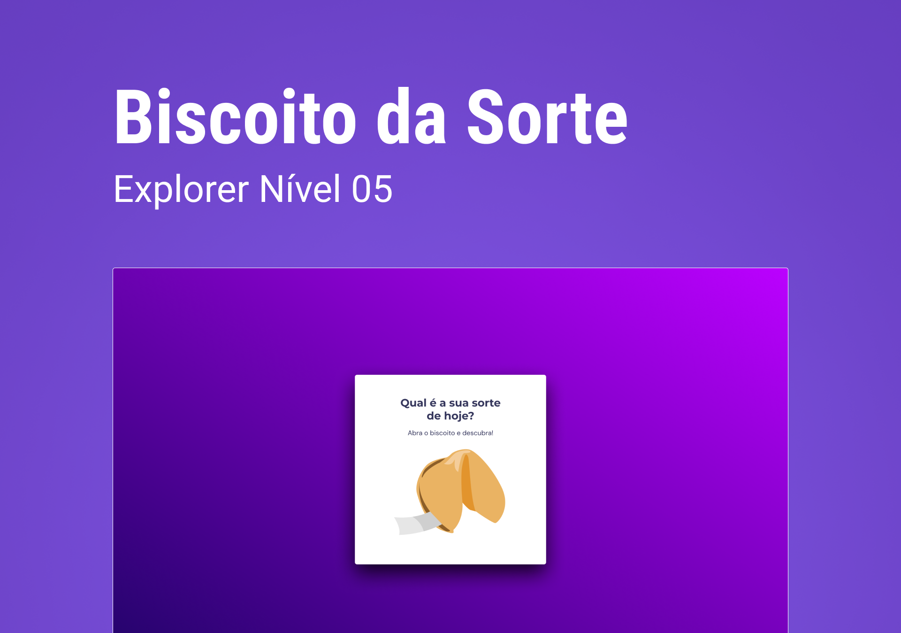

<h1 align="center"> Componente Trabalho </h1>

Projeto avançado do explorer 10, Biscoito da Sorte  
<a href="https://www.rocketseat.com.br/explorer">Connheça o Explorer.</a>

  <a href="#-tecnologias">Tecnologias</a>&nbsp;&nbsp;&nbsp;|&nbsp;&nbsp;&nbsp;
  <a href="#-projeto">Projeto</a>&nbsp;&nbsp;&nbsp;|&nbsp;&nbsp;&nbsp;
  <a href="#-layout">Layout</a>&nbsp;&nbsp;&nbsp;|&nbsp;&nbsp;&nbsp;
  <a href="#memo-licença">Licença</a>

  

 

  

## 🚀 Tecnologias

Esse projeto foi desenvolvido com as seguintes tecnologias:

- HTML
- CSS
- JavaScript
- Git e Github
- Figma

## 💻 Projeto
Criamos um jogo chamado **Biscoito da Sorte**, no qual o usuário, **a partir de um clique ou enter**, abre um biscoito com a sua sorte do dia. 
Conseitos aplicados:
- Estrutura de dados HTML
- Animações com CSS
- Funções no Javascript
- Manipulação da DOM
- Biblioteca JS Math()
- Funções _callback_
- Arrays.

- [Acesse o projeto finalizado, online](https://erlanmarinho.github.io/explorerJogoDaAdvinhacao/)

## :memo: Licença

Esse projeto está sob a licença MIT.

---

Feito com ♥ by Rocketseat :wave: [Participe da nossa comunidade!](https://discord.gg/rocketseat)
